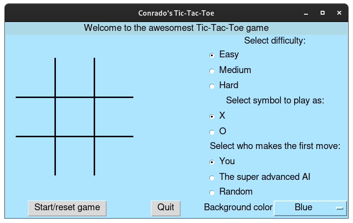

# tic-tac-toe
Tic-tac-toe game implemented in Python 3.6+

## Getting Started

To run the game, simply download the entire folder and run:
```
python tictactoe.py
```
for the command line interface version, or:
```
python tictactoeGUI.py
```
for the GUI version.

## Screenshot




### Prerequisites

Python 3.6 or above.

That's it! The GUI library is already included (appJar folder).

## Built With

* [appJar](http://appjar.info) - The GUI framework used.

## License

The CLI version of the game is free to be downloaded, modified and redistributed (even for commercial uses). The software is "as is", so there are no warranties and I take no resposabilities for any use of it.

The GUI version is restricted by the use of appJar library - from their website:
>appJar is released under the Apache License 2.0
>
>So, you're free to use it, modify it & redistribute it, as long as you acknowledge my copyright, and aren't trying to make money out of it...
